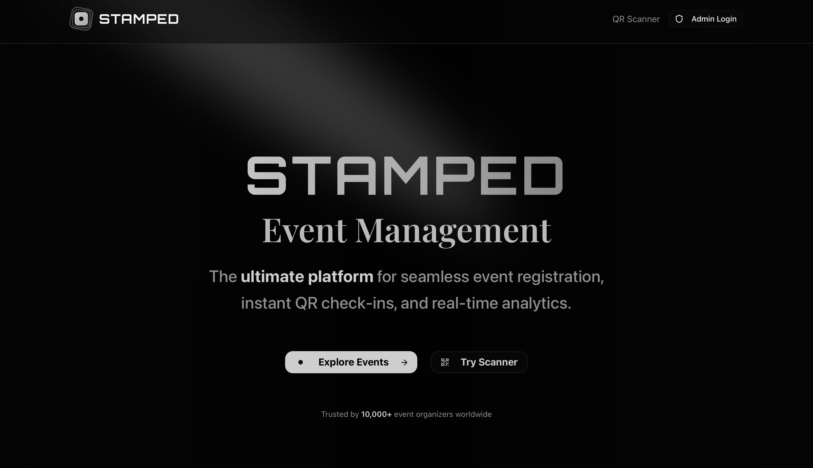

<p align="center">
   
</p>

# Stamped - Event Management & Attendance System

A modern, full-stack event management system with QR code-based attendance tracking. Features a sleek dark-themed frontend built with Next.js 15 and a robust backend API with Node.js, Express, and MongoDB. This project demonstrates full-stack development skills including modern React patterns, API design, database modeling, authentication, and real-time attendance tracking.

## Features

### 🎯 Core Functionality
- **Event Management**: Create and manage events with full CRUD operations
- **Participant Registration**: Register for events with automatic QR code generation
- **Smart Attendance Tracking**: Advanced QR code-based check-in system with duplicate prevention
- **Admin Authentication**: JWT-based secure admin access with protected routes
- **Email Integration**: Automatic QR code delivery via email
- **Data Export**: Export attendance data as CSV/Excel files

### 🎨 Frontend Features
- **Modern Dark Theme**: Sleek, professional dark-themed UI with consistent styling
- **Responsive Design**: Mobile-first design that works on all devices
- **Real-time Scanner**: Advanced QR code scanner with live camera feed
- **Enhanced Scanner Display**: Shows participant info, event details, and attendance statistics
- **Session Tracking**: Real-time statistics for scanning sessions
- **Interactive UI**: Smooth animations and hover effects
- **Accessibility**: Proper ARIA labels and keyboard navigation

## Tech Stack

### Backend
- **Node.js** + **Express.js** - RESTful API server
- **MongoDB** + **Mongoose** - Database and ODM
- **JWT** - Authentication and authorization
- **QRCode** - QR code generation
- **Nodemailer** - Email service integration
- **Jest** - Testing framework
- **Winston** - Logging

### Frontend
- **Next.js 15** - React framework with App Router
- **TypeScript** - Type-safe development
- **Tailwind CSS v4** - Utility-first styling with dark theme
- **shadcn/ui** - Modern component library
- **Aceternity UI** - Advanced UI components and animations
- **Framer Motion** - Smooth animations and transitions
- **QR Scanner** - Real-time QR code scanning
- **React Hot Toast** - Toast notifications

## Project Structure

```
stamped/
├── backend/                    # Backend API server
│   ├── config/                # Database and middleware configuration
│   ├── middleware/            # Authentication and error handling
│   ├── models/               # MongoDB data models (Event, Participant, Admin)
│   ├── routes/               # API route handlers
│   ├── utils/                # Utility functions (QR, email, validation)
│   ├── seed/                 # Database seeding scripts
│   └── server.js             # Application entry point
├── frontend/                  # Next.js frontend application
│   ├── app/                  # App Router pages and layouts
│   │   ├── dashboard/        # Admin dashboard
│   │   ├── events/           # Event management pages
│   │   ├── login/            # Admin login
│   │   ├── scanner/          # QR code scanner
│   │   └── globals.css       # Global styles and theme
│   ├── components/           # Reusable UI components
│   │   ├── ui/               # shadcn/ui components
│   │   └── EventCard.tsx     # Custom components
│   ├── lib/                  # Utility functions
│   └── public/               # Static assets
├── README.md                 # Project documentation
├── env.example               # Environment variables template
├── EMAIL_SETUP_GUIDE.md      # Email configuration guide
└── test-email.js             # Email testing script
```

## Getting Started

### Prerequisites

- Node.js (v18 or higher)
- MongoDB (local installation or MongoDB Atlas)
- npm

### Installation

1. **Clone and navigate to the project**

   ```bash
   git clone <repository-url>
   cd stamped
   ```

2. **Backend Setup**

   ```bash
   cd backend
   npm install
   ```

3. **Frontend Setup**

   ```bash
   cd ../frontend
   npm install
   ```


4. **Environment Setup**

   ```bash
   # From the root directory
   cp env.example .env
   ```

   > **Frontend Environment Variables**
   >
   > Next.js only loads environment variables from `.env.local` (or `.env`) inside the `frontend/` directory. If you want to keep a single source of truth for your environment variables at the project root, you can symlink or copy the file:
   >
   > ```bash
   > # Symlink root .env.local to frontend/.env.local (recommended for local dev)
   > ln -s ../.env.local ./frontend/.env.local
   > # Or copy if symlinks are not supported
   > cp ../.env.local ./frontend/.env.local
   > ```
   >
   > This ensures the frontend picks up the correct environment variables. You must restart the frontend dev server after changing `.env.local`.

   Update the `.env` file with your configuration:

   ```env
   # Database
   MONGODB_URI=mongodb://localhost:27017/stamped-attendance

   # Server Configuration
   PORT=5001
   NODE_ENV=development

   # API Configuration
   API_URL=http://localhost:5001
   NEXT_PUBLIC_API_URL=http://localhost:5001

   # JWT Secret (use a strong secret in production)
   JWT_SECRET=your-super-secret-jwt-key-here

   # Admin Credentials (for seeding)
   ADMIN_USERNAME=admin
   ADMIN_PASSWORD=admin123

   # Email Configuration (for QR code delivery)
   EMAIL_HOST=smtp.gmail.com
   EMAIL_PORT=587
   EMAIL_USER=your-email@gmail.com
   EMAIL_PASS=your-app-password
   EMAIL_FROM=your-email@gmail.com
   ```

   **Key Variables:**
   - `PORT`: Backend server port (default: 5001)
   - `NEXT_PUBLIC_API_URL`: Frontend API URL (default: http://localhost:5001)
   - `MONGODB_URI`: MongoDB connection string
   - `JWT_SECRET`: Secret key for JWT tokens

5. **Start MongoDB**

   ```bash
   # If using local MongoDB
   mongod

   # Or use Docker
   docker run -d -p 27017:27017 --name mongodb mongo:latest

   # Or use MongoDB Atlas connection string in MONGODB_URI
   ```

6. **Seed the database**

   ```bash
   cd backend
   npm run seed
   ```

7. **Start the development servers**

   ```bash
   # Terminal 1 - Backend
   cd backend
   npm run dev

   # Terminal 2 - Frontend
   cd frontend
   npm run dev
   ```

- Backend API: `http://localhost:5001`
- Frontend App: `http://localhost:3000`


## API Endpoints

### Authentication

- `POST /api/auth/login` - Admin login
- `GET /api/auth/verify` - Verify JWT token

### Events

- `GET /api/events` - Get all events
- `GET /api/events/:id` - Get specific event
- `POST /api/events` - Create new event (admin)
- `PUT /api/events/:id` - Update event (admin)
- `DELETE /api/events/:id` - Delete event (admin)

### Participants

- `POST /api/registrations` - Register for event
- `GET /api/registrations/event/:eventId` - Get event registrations (admin)

### Attendance

- `POST /api/attendance/mark` - Mark attendance via QR code
- `GET /api/attendance/event/:eventId` - Get event attendance (admin)
- `GET /api/attendance/stats/:eventId` - Get attendance statistics (admin)

### Export

- `GET /api/export/:eventId` - Export event data as Excel

## 🎯 Enhanced QR Scanner Features

The scanner page (`/scanner`) includes advanced functionality for real-time attendance tracking:

### Scanner Capabilities
- **Live Camera Feed**: Real-time QR code detection with camera access
- **QR Code Preview**: Shows scanned data before processing
- **Session Statistics**: Tracks total scans and successful attendance markings
- **Duplicate Detection**: Prevents double-check-ins with detailed error messages


### Testing Status
⚠️ **Currently in Testing Mode**: The QR scanner is actively being tested and refined. Features may be updated based on testing feedback.


## Key Features Demonstrated

- **RESTful API Design**: Clean, consistent API endpoints
- **Database Modeling**: Proper schema design with validation
- **Authentication**: JWT-based auth with middleware
- **Error Handling**: Centralized error handling and logging
- **Input Validation**: Server-side validation for all inputs
- **Testing**: Comprehensive test coverage
- **Email Integration**: Automated email notifications
- **File Generation**: QR code and Excel export functionality

---

This project demonstrates backend development best practices including API design, database modeling, authentication, testing, and integration with external services.
