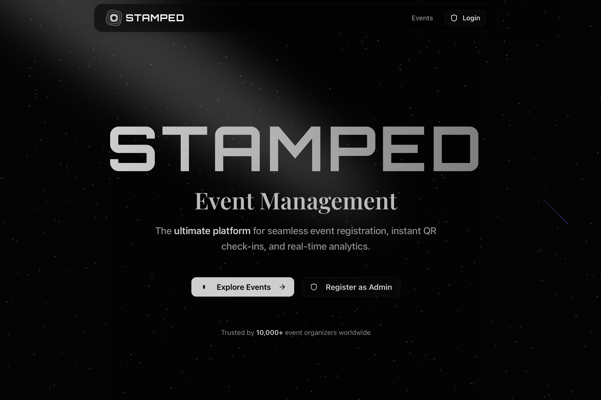
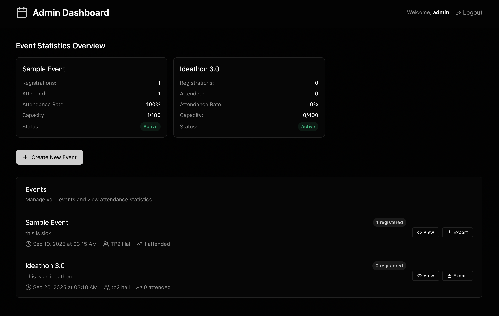

# Stamped

**Event management system with QR code attendance tracking**

## Screenshots

### Website Landing Page



### Admin Dashboard



## 📋 Table of Contents

- [Features](#-features)
- [Route Structure](#-route-structure)
- [Planned Features](#-planned-features)
- [Tech Stack](#-tech-stack)
- [Quick Start](#-quick-start)
- [Documentation](#-documentation)
- [Live Demo](#-live-demo)

## ✨ Features

### Current Features

- **Event Management** - Create and manage events with full CRUD operations
- **QR Code Attendance** - Real-time QR code scanning for instant check-ins
- **Admin Dashboard** - Comprehensive analytics and event management with dark theme
- **Digital Tickets** - Professional PDF ticket generation with QR codes and auto-download
- **Data Export** - Export attendance data as CSV/Excel files
- **Responsive Design** - Mobile-first design that works on all devices
- **Smart Validation** - Prevents duplicate registrations and ensures data integrity
- **User Experience** - Simplified scanner feedback and improved registration flow
- **SuperAdmin** - Superadmins can view/pause/delete all the events without interference of organizers

## 🗂️ Route Structure

### Public Routes
- `/events` - Browse all active events
- `/events/[id]` - **Public event page** with registration form (no admin interference)
- `/events/[id]/thank-you` - Registration confirmation page

### Admin Routes  
- `/admin/dashboard` - Admin dashboard with event management
- `/admin/events/create` - Create new events (admin-only)
- `/admin/events/[id]` - **Admin event page** with participant management
- `/admin/events/[id]/scanner` - QR code scanner for attendance (admin-only)
- `/auth/login` - Admin authentication
- `/auth/register` - Admin registration

### Key Features
- **Complete separation** - Public and admin routes are completely isolated
- **No session interference** - Admin sessions don't affect public event viewing
- **Event-specific scanners** - Each event has its own scanner for security
- **Always-visible participants** - Admin page shows participant list without toggle buttons
- **Clean file structure** - Organized admin routes under `/admin/` prefix

### 🚧 Planned Features

- **Advanced Event Controls** - Edit participant limits even hide it,  manage event visibility settings etc.
- **Enhanced Event Media** - Image carousels and video playback in event cards and detail pages
- **Advanced Analytics** - Improved reporting and insights dashboard
- **SuperAdmin Management** - SuperAdmins can apprently only deal with events,but very soon they'll manage organizer accounts and have access to all events
- **Billing & Subscriptions** - Usage-based pricing and subscription management

## 🛠️ Tech Stack

### Frontend

- **Next.js 15** - React framework with App Router
- **Tailwind CSS** - Utility-first styling
- **shadcn/ui** - Modern component library
- **Aceternity UI** - Advanced animations and effects

### Backend

- **Node.js** - Runtime environment
- **Express.js** - Web framework
- **MongoDB** - Database
- **JWT** - Authentication
- **QRCode** - QR generation
- **jsPDF** - PDF ticket generation

## 🚀 Quick Start

### Prerequisites

- Node.js (v18+)
- MongoDB (local or Atlas)
- npm

### Installation

1. **Clone the repository**

   ```bash
   git clone https://github.com/yourusername/stamped.git
   cd stamped
   ```

2. **Install dependencies**

   ```bash
   # Backend
   cd backend && npm install

   # Frontend
   cd frontend && npm install
   ```

3. **Environment setup**

   ```bash
   cp env.example .env
   # Update .env with your configuration
   ```

4. **Start development servers**

   ```bash
   # Backend (Terminal 1)
   cd backend && npm run dev

   # Frontend (Terminal 2)
   cd frontend && npm run dev
   ```

### Access Points

- **Frontend**: http://localhost:3000
- **Backend API**: http://localhost:5001

## 📚 Documentation

| Document                 | Description                                           | Link                                            |
| ------------------------ | ----------------------------------------------------- | ----------------------------------------------- |
| 📖 **API Reference**     | Complete API endpoints with request/response examples | [View API Docs](docs/API.md)                    |
| 🏗️ **Project Structure** | Detailed file organization and directory explanations | [View Structure Guide](docs/STRUCTURE.md)       |
| ⚙️ **Environment Setup** | Configuration guide for development and production    | [View Environment Guide](docs/ENV.md)           |
| 📝 **Changelog**         | Track of all updates, improvements, and bug fixes     | [View Changelog](docs/CHANGELOG.md)             |
| 🚀 **Quick Reference**   | Developer commands, debugging tips, and common tasks  | [View Quick Reference](docs/QUICK_REFERENCE.md) |

### Quick Navigation

- **Getting Started**: See [Quick Start](#-quick-start) section below
- **API Integration**: Check [API Documentation](docs/API.md) for endpoint details
- **Development Setup**: Follow [Environment Guide](docs/ENV.md) for configuration
- **Code Organization**: Review [Structure Guide](docs/STRUCTURE.md) for file layout

## 🤝 Contributing

This project is **open to contributions**! We welcome community involvement in:

- 🐛 Bug fixes and improvements
- ✨ New feature development
- 📚 Documentation enhancements
- 🎨 UI/UX improvements
- 🧪 Testing and quality assurance

Feel free to open issues, submit pull requests, or reach out with ideas!

---

**Built with ❤️ by [Sourish Ghosh](https://github.com/7sg56)**
